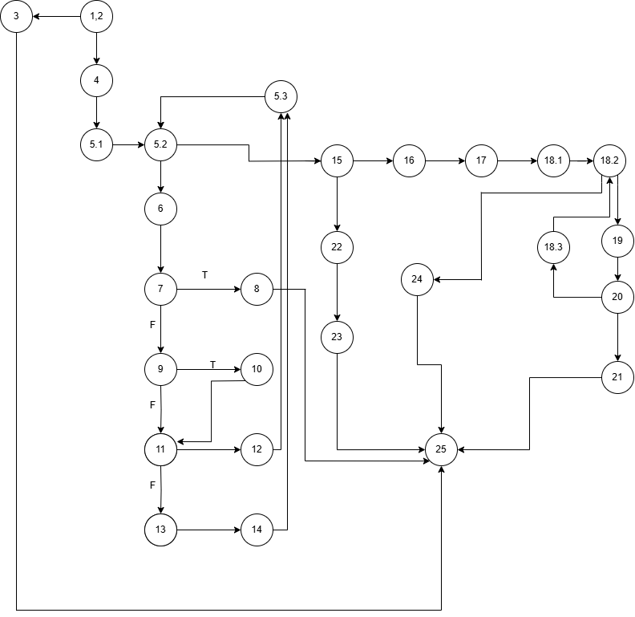

# Втора лабораториска вежба по Софтверско инженерство
# Дејвид Бошковски, бр на индекс 235026
# Control Flow Graph
  
# Цикломатска комплексност
  Цикломатската комплексност на кодот ја пресметав со броење на предикатните јазли + 1, во овој случај тоа е 9.
# Тест случаи според критериумот Every statement
  1. allItem = null
     Бидејќи allItem = null фрла exception и кодот завршува.
  2. Item = "Milk", 1, 150, 0.0, cardNumber = "1234567890123456"
     Валиден item и card number, цена и количина, нема попуст, враќа точна сума. 
  3. Item = "Bread", 2, 60, 0.1, cardNumber = "1234567890123456"
     Валиден item и card number, цена и количина, има попуст, враќа точна сума.
  4. Item = "Eggs", 20, 10, 0.0, cardNumber = "123456789012AA56"
     Валиден item, невалиден card number, цена, количина > 10, нема попуст, фрла exception и кодот завршува.
  5. Item = "null", 1, 100 , 0.0, cardNumber = "1234567890123456"
     Невалиден item name, валиден card number, цена и количина, нема попуст, враќа точна сума.
  6. Item = "Juice", 1, 80 , 0.0, cardNumber = "12345678"
     Валиден item, но краток card number, цена и количина, нема попуст, фрла exception и кодот завршува.
  За изминување на секој statement за оваа функција се потребни 6 тест случаи. 4 ни се потребни да се измине секој 
  exception и уште 2 тест случаи да ги изминеме сите if услови со тоа што имаме и 1 else. 
# Тест случаи според критериумот Multiple Condition
  1. FFF -> Item = "Lemons" , 5, 100, 0.0
     Цена помалку од 300, нема попуст, и количина помалку од 10.
  2. TFF -> Item = "Watermelon", 1, 350, 0.0
     Цена повеќе од 300, нема попуст, и количина помалку од 10.
  3. FTF -> Item = "Bread", 3, 90, 0.1
     Цена помалку од 300, има попуст, и количина помалку од 10.
  4. FFT -> Item = "Eggs", 20, 10, 0.0
     Цена помалку од 300, нема попуст, и количина повеќе од 10.
  5. TTF -> Item = "Steak", 3, 400, 0.3
     Цена повеќе од 300, има попуст, и количина помалку од 10.
  6. TFT -> Item = "Strawberry", 20, 400, 0.0
     Цена повеќе од 300, нема попуст, и количина повеќе од 10.
  7. FTT -> Item = "Apple", 10, 250, 0.2
     Цена помалку од 300, има попуст, и количина повеќе од 10.
  8. TTT -> Item = "Burger", 10, 2000, 0.3
     Цена повеќе од 300, има попуст, и количина повеќе од 10.
  За изминување на Multiple Condition се потребни 8 тест случаи
# Објаснување на напишаните unit tests
  Во функцијата testEveryStatement() ги имплементирав 6-те тест случаи кои ја покриваат 
  секоја линија барем еднаш.
  Во функцијата testMultipleCondition() ги покрива сите 8 можни комбинации на условот со OR 
  логика.
